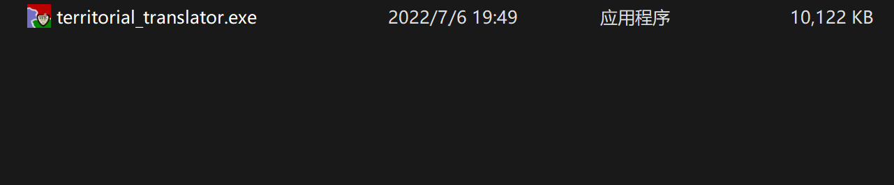
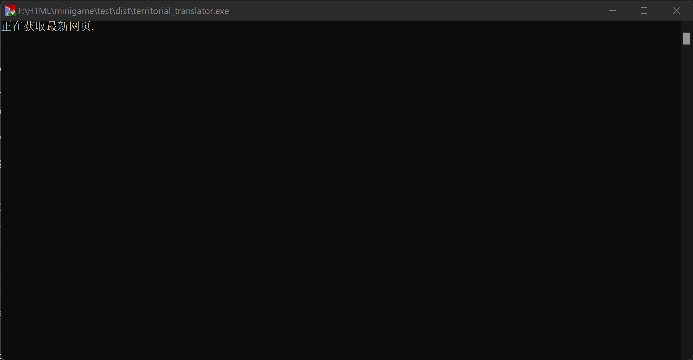
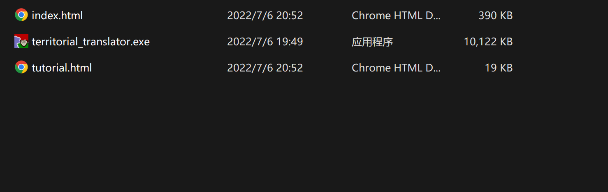
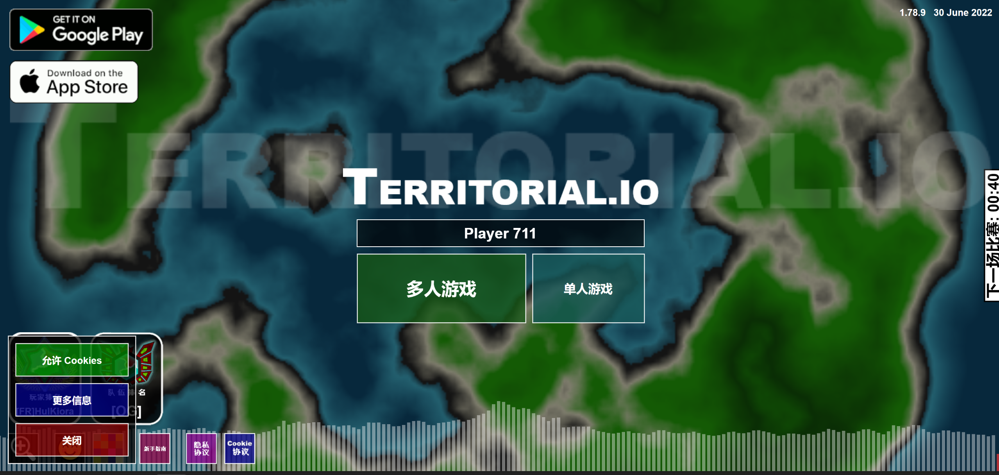

# territorial.io汉化工具使用指南

### 前言

​	**territorial.io** 译作 **领土.io** 是一款基于JavaScript的地图游戏。 *territorial.io汉化工具* 是对该游戏文本进行汉化的一个工具。由于浏览器自带的翻译功能无法对JavaScript内字符串进行翻译，使用该工具可以解决这一问题，使玩家可以方便地进行游玩。

### 使用指南

​	1.从github或其他途径下载汉化工具 *(territorial_translator.exe)*

​	2.双击运行该工具

​	3.程序运行完成后生成对应版本的HTML文件

​	4.双击打开index.html就可以进行游玩了

### 常见问题解答Q&A

​	**Q** ：为什么网页打开后有点模糊？
​	**A** ：territorial.io网页源码内嵌图片，大小较小，将页面缩放改小 *(至25%左右)* 可以提高清晰度。

​	**Q** ：生成的另一个网页文件有什么作用？
​	**A** ：另一个网页文件是汉化后的教程，我们把汉化后游戏网页上教程的超链接指向了这个网页。

​	**Q** ：为什么我无法联机/联机提示需要更新？
​	**A** ：territorial.io禁止了旧版本页面的多人游戏功能，这正是汉化工具存在的原因。territorial.io更新速度很快，因此生成的网页大约一周左右就会需要重新获取。这种情况再次运行汉化工具即可，汉化工具会为您爬取最新版本的游戏页面。

​	**Q** ：为什么我打开后地图图片黑屏/全部黑屏？
​	**A** ：请检查生成的 *index.html* 大小是否为300Kb左右，如过小可能是因为网络问题，游戏页面无法获取完全。不是上述问题的话，有可能是territorial.io官方对游戏源码进行了大幅度调整，汉化工具需要调整以适应改动，请在github项目页向我们发送issue告诉我们。

​	**Q** ：这个游戏官方教程太简略了，有些功能没有讲到怎么办？
​	**A** ：教程页面是按照官网的内容直接翻译而来。如需详细教程，敬请观看 **SFKgroup** 在B站发布的教程。

​	**Q** ：为什么我的页面有部分没有完全汉化？
​	**A **：出去玩家名称我们无法汉化以外，遇到未汉化文本可能是因为territorial.io官方对游戏源码进行了调整，文本替换无法匹配，请在github项目页向我们发送issue告诉我们。

### 写给其他开发者

​	本项目源代码开源，其实原理很简单，就是 *replace()* ，将英文文本变为中文文本。但有几点是要特别说的：

​	1.territorial.io官方使用了代码混淆，所以每个版本的变量命名都是有差别的，replace的时候最好不要带入有关变量名的代码。

​	2.在单人游戏的国家名称翻译时，我们遇到了极大的问题。源码国名列表越靠后其国家名称越是难以找寻。territorial.io这个游戏里所有的国家名称都是现实存在或者在历史上存在过的，为了凑够500余个国家名称，原作者使用了大量的小众的历史国家，例如： *Gwiriko，Wogodogo，con* 这几个国名都是布基纳法索一地的历史政权名称，这三个单词甚至都没有官方中译名，唯一可以查询到的网站也是外网全英文的网站。我们只能根据音译对这几个国名进行翻译。而还有部分单词具有多重含义或者是非英语词汇，在网络上根本无从搜寻或结果完全无关。因此我们舍弃了约80个极难翻译的国家名称，将其更改为了之前未提到的现代国家名称或中国古代诸侯国名。当然，如： *曹魏，蜀汉，隋，殷商，河南苏维埃* 等部分古代或近现代国名、地方名称是作者本来就有的，这里我们只是如实翻译而已。

​	3.因为法律等原因，我们将官方的油管和ins链接进行了屏蔽，Google和Apple的链接是作者自身的链接，若出现问题，与本汉化组无关，也请其他开发者不要对这方面进行过分改动，谢谢！

​	4.关于部分词汇的翻译问题：

​		**balance** ：本义为平衡，字典上有引申义为余额。未发现其他更贴切义项，因此这里译作 **余额** 。

​		**Interest** ：本义为兴趣、爱好，字典上有引申义为利息。由于游戏这里实际上代表了数值的增长速度，因此可以作 **利息** 义。

​		**Harder** ：游戏关于难度的分级为: *Very Easy;Easy;Normal;Hard;Harder;Very Hard* 因为中文比较级翻译为 *更难一些* 难以让玩家直观感受难度的区分，因此将难度重新划分为; *非常简单;简单;常规;困难;非常困难;地狱*

​		**cost** ：本义为价钱，字典上有引申义为 *成本、代价* 和 *损失* ，由于之前balance译作余额，interest译作利息，因此这里也使用了与经济相近的义项，故译作 **成本** 。

​		**Clan** ：本义为宗族，字典上有引申义为 *帮派、大家族* 和 *部落* ，由于家族更偏向于有血缘关系，而帮派不符合游戏主题，因此这里译作 **部落** 。其本质上就是玩家团体，官方也常将其与team混用，所以”部落“本质上就是玩家队伍。

​		**Plateau** ：本义为高原，字典上有引申义为稳定期，因其代表的是每日游玩人数的评价，因此将其翻译为 **稳定期** 。

​		**The iFrame Explosion** ：这是作者大事件记录中的一条，直译是 iFrame爆炸，iFrame是HTML标签，作用是文档中的文档，或者浮动的框架(FRAME)。这句话可以理解为iFrmae爆炸了，也可以理解为“让iFrame爆炸吧”。我在源码的浏览中未发现使用iFrame，因此选择了后一种义项，表达作者的感叹。如有了解该游戏历史的老玩家，请给我们发送issue，告诉我们这段历史，以更好地翻译这句话。

​		**Mountain** ：本义为山，字典上有引申义为 *许多、大量* 和 *过剩* 但作者在描述游玩人数的时候使用了该词，以表达这段时间内玩家游玩时间像山一样增多然后减少。因为过程不是单调的，因此这里译作 **起伏** 。

​	**以上这些都是有部分争议的翻译内容，如果大家有更好的想法请给我们发送issue告知。**

| ----  SFKgroup |
| -------------: |
|     2022.07.06 |

